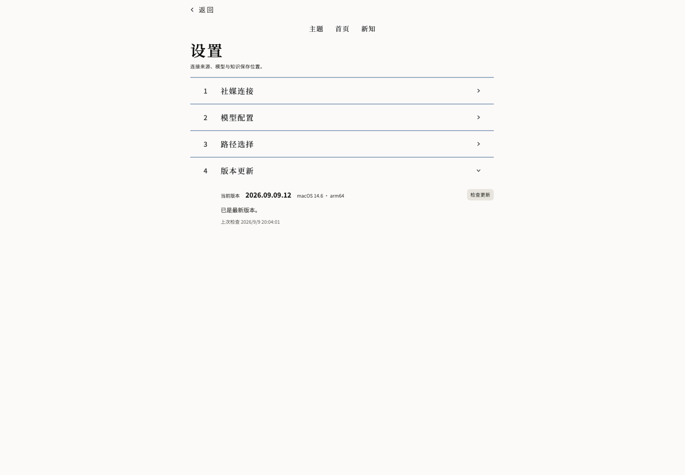

# 知识蒸馏器 · Knowledge Distiller

**把值得留下的内容，变成有依据、能回找、可继续思考的个人知识。**

知识蒸馏器是一款个人、本地优先的知识工具。你把感兴趣的视频链接、图文、文章、文本或文档交给它，它恢复可读的来源内容，提炼有依据的观点，保存到自己的 Obsidian 知识库；随着材料积累，你还可以主动整理主题、发现联系，并留下自己的判断。

它关心的是一段完整的过程：**从看见，到理解，到沉淀，再到下一次思考。**

[下载最新版本](https://github.com/YYuCChen/Knowledge-Distillation/releases/latest) · [开始使用](#开始使用) · [功能与来源](#功能与来源) · [常见问题](#常见问题) · [反馈问题](https://github.com/YYuCChen/Knowledge-Distillation/issues)

> 当前公开版本：**2026.09.09.12**，适用于 **macOS 14 及以上的 Apple Silicon Mac**。Windows 构建与发行正在接续，尚无公开的 Windows 安装包。此仓库用于项目介绍、版本分发和反馈；应用源码目前保持私有。

## 目录

- [为什么做知识蒸馏器](#为什么做知识蒸馏器)
- [从一份材料到一套知识](#从一份材料到一套知识)
- [几个贯穿产品的原则](#几个贯穿产品的原则)
- [功能与来源](#功能与来源)
- [开始使用](#开始使用)
- [日常使用的一次完整旅程](#日常使用的一次完整旅程)
- [Obsidian 与本地数据](#obsidian-与本地数据)
- [本地处理联网服务与费用](#本地处理联网服务与费用)
- [安装与版本更新](#安装与版本更新)
- [项目是怎样走到这里的](#项目是怎样走到这里的)
- [技术组成](#技术组成)
- [当前状态与接下来的方向](#当前状态与接下来的方向)
- [常见问题](#常见问题)
- [反馈与交流](#反馈与交流)
- [源码与第三方项目](#源码与第三方项目)

## 为什么做知识蒸馏器

我们每天都会遇到值得留下的东西：一段把问题说透的视频，一篇给出具体方法的文章，一组有启发的图文，一本读到一半的书。

当下觉得有用，先收藏起来。过了一段时间，只记得自己看过，却想不起那条内容在哪里、作者到底怎么说、某个结论成立需要什么条件。即使留下了一段摘要，真正需要用它时，往往还得重新找原文、重新理解一次。

知识蒸馏器从这个很具体的个人需求出发：**让一次认真看过的内容，能够成为以后仍然用得上的知识。**

因此，保存一条链接只是开始。接下来还需要把材料读完整，分清观点与依据，保留来源和适用条件，把它放到能够回找的位置。积累到一定程度后，还需要重新审视这些材料之间的关系：哪些在谈同一个问题，哪些可以相互补充，哪些看似相近，实际上有重要差别。

这个项目先为真实的个人使用建立这些能力，再通过持续使用、反馈和迭代，把它打磨成可以分享给其他人的桌面工具。它追求的体验是安静、清楚、可靠：提交材料时操作简单，核对证据时看得明白，长期留下的东西由自己持有。

## 从一份材料到一套知识

整个产品围绕三个相互连接的循环展开。

### 1. 投递与沉淀

把受支持的链接、纯文本或文档交给应用。根据材料类型，它会取得正文、处理音频转写、识别图片文字，或解析文档结构，再提炼可以由来源支撑的观点。

一份来源型笔记通常包含标题、内容概览、观点、论证、对应证据以及可读的来源全文。你可以先快速了解它，也可以沿着证据回到具体内容。

### 2. 回找与阅读

刚处理完的材料可以从首页查看。积累后，主题页帮助你围绕具体问题浏览知识；本地搜索则帮助你找到已有的主题、观点与已认可新知。

应用承担快速浏览和定位，Obsidian 承担更舒展的深读与长期保存。需要核查时，可以继续回到原平台或原始文档。

### 3. 整理与生长

点击「开始整理」，应用会基于已有知识组织主题、梳理关系，并在有依据时提出新的联系或判断。

这些新知会等待你的回应。你可以选择「有点意思」或「再想想」，留下批注，也可以在以后追加新想法、改变原来的看法。理解可以继续生长，而过去的来源与判断过程仍然保留。

| 你想做的事 | 去哪里 |
|---|---|
| 提交新材料、查看处理情况、处理待办、开始整理 | 首页 |
| 围绕一个问题浏览知识、搜索已有内容 | 主题 |
| 判断新发现、回顾已有判断、继续思考 | 新知 |
| 连接平台、配置模型、选择保存位置、检查更新 | 设置 |
| 连续深读来源型笔记、核查完整上下文 | Obsidian |

## 几个贯穿产品的原则

### 来源、AI 判断和你的看法，各自有清楚的位置

作者说过什么、AI 根据材料推导出什么、你认为什么值得保留，是三种不同的内容。知识蒸馏器在存储和展示上保留这种区别。

来源型观点需要有材料中的依据。跨材料形成的新知保留其形成依据，并明确属于 AI 衍生内容。只有你主动提交，个人批注、认可和改观才会成立。

### 一条观点应该能够回到证据

留下一个结论的同时，也应该能回答：它来自哪里？原来的说法是什么？有哪些前提和限制？

因此，提炼后的观点仍然连接着论证、证据与来源。必要的条件和不确定性应跟随判断保留下来，便于以后重新理解和核查。

### 重要疑点交给人，处理结果如实呈现

如果语音或图片文字中的局部疑点会影响理解，应用会提供核对待办，帮助你结合上下文确认、纠正，或保留无法辨认的部分。

材料无法完整取得、当前账号无权访问、内容不足以支撑知识，都会影响能否继续处理。界面应说明实际情况，已经完成的有效步骤也应保留下来，方便恢复。

### 整理的时机与认知的取舍由你决定

知识整理由用户主动发起。普通浏览、展开卡片和搜索不会顺带触发一次模型生成。

AI 可以提出有依据的新联系，你决定它是否有意思、是否还需要再想想。积累知识的节奏，始终掌握在使用者手里。

### 长期留下的数据由自己持有

程序的正式记录保存在本机 SQLite 中，来源型笔记写入自己选择的 Obsidian Vault。笔记是可以独立打开的 Markdown 文件，知识不会只存在于某个网页对话窗口里。

## 功能与来源

### 多种材料进入同一条知识处理流程

当前版本已接入以下来源。表中的范围是入口概述；每个平台都有具体的内容类型、登录、权限和完整性条件，并不意味着该平台上的任意页面都可处理。

| 来源 | 当前主要处理范围 | 使用时需要注意 |
|---|---|---|
| 抖音 | 已支持的视频、图文与文章类型；作者主页、合集等范围入口 | 批量范围需要先确认，合集内每条材料分别处理 |
| 小红书 | 普通图文笔记与视频笔记 | 可识别笔记链接和短链接；登录、浏览器连接与内容权限会影响获取 |
| 知乎 | 回答、文章、想法中的完整文本 | 保留必要的问题上下文；不把页面中的任意图片或视频当作已支持内容 |
| 微博 | 已支持的普通文本、原生长文本与文章类型 | 按原帖身份读取，具体媒体类型仍有边界 |
| X | 普通文字与静态图片主帖 | 区分主帖与引用内容；不承诺视频、GIF、Article 等类型 |
| YouTube | 已结束的视频与 Shorts 的音频内容，及可取得的选定字幕 | 主要处理讲述内容，不分析视频画面 |
| B 站 | 已接入的视频音频与可识别的分 P、列表等范围入口 | 先确认实际素材范围；受登录、访问权限与平台限制影响 |
| 直接文本 | 粘贴的一整段正文 | 按提交的内容处理，可补充来源信息 |
| PDF | 可可靠解析的原生、扫描与混合文档正文 | 保留页与结构定位；无法可靠恢复的内容会明确失败 |
| EPUB | 可读取的书籍正文与章节结构 | 复杂结构、缺失资源或受保护内容可能无法处理 |
| Markdown | 单个 UTF-8 `.md` 或 `.markdown` 文件 | 不递归导入目录、Vault、附件或外链 |

分享文本里包含受支持的素材链接时，应用优先按素材链接处理。平台附带的推荐语、分享口令和外围文案不会被直接当作文章正文来蒸馏。

### 多条材料与同题处理

多条材料可以分别处理；对于已支持的同题入口，也可以在确认范围后一起处理。每条材料仍保留独立身份、来源与结果，综合处理不会抹掉它们之间的区别。

范围型任务可能出现部分完成。某一条失败，并不等于其他已经完成的材料需要重做；需要完整材料集合才能形成的综合结果，也不会以部分输入冒充完成。

### 从飞书投递

除了在电脑上提交，也可以配置自己的飞书应用机器人，通过已绑定的私聊发送链接或文字。

- 一条消息对应一次投递，多链接默认分别处理。
- 在支持的同平台素材范围内，消息中实际 @ 机器人可表达同题处理意图。
- 接收后使用同一张卡片更新结果，减少连续的阶段提醒。
- 支持必要待办的电脑端与飞书端处理，以及连接恢复后的历史补收。

飞书是远程投递与必要待办入口。知识生产仍在你的电脑上进行，因此电脑需要开机、应用需要运行。当前不支持通过飞书投递任意文件、图片或音频，也不提供飞书知识库同步。

## 开始使用

### 1. 下载并安装

打开 [Releases](https://github.com/YYuCChen/Knowledge-Distillation/releases/latest)，下载与你的设备对应的安装附件。

当前 Mac 文件名为：

```text
KnowledgeDistiller-2026.09.09.12-macOS-arm64.zip
```

解压后，把「知识蒸馏器.app」放入「应用程序」，再打开。应用会启动本地服务，并在浏览器中显示界面。基础运行依赖已经打包，使用者无需另行搭建 Python 开发环境。

请下载 **Assets 中的应用安装包**。GitHub 自动生成的 `Source code (zip)` 和 `Source code (tar.gz)` 不是应用安装包。

当前 Mac 包采用 ad-hoc 签名，尚未进行 Apple Developer ID 签名与公证。首次打开可能出现系统安全提示。确认文件来自本项目发布页后，请依据 [Apple 官方说明](https://support.apple.com/zh-cn/102445)处理；不需要关闭系统整体安全保护。

### 2. 选择知识保存位置

安装 [Obsidian](https://obsidian.md/)，准备一个自己的 Vault。在知识蒸馏器的「设置 → 路径选择」中选择这个文件夹。

如果选择的是尚未在 Obsidian 中打开过的普通文件夹，需要先在 Obsidian 使用「打开文件夹作为仓库」，再回到应用重新检查。文件夹可写与 Obsidian 已识别该仓库，是两个不同的状态。[Obsidian 仓库管理说明](https://obsidian.md/help/manage-vaults)

### 3. 配置模型

在「设置 → 模型配置」中完成 LLM 配置。当前提供本机 Codex / ChatGPT 订阅连接，以及 API 配置入口；实际可选型号、调用条件与用量限制以所连接的服务为准。

准备处理有声内容时，再配置 ASR（语音识别）：

| 方案 | 运行方式 | 配置重点 |
|---|---|---|
| Qwen3-ASR 1.7B | Apple Silicon Mac 本地组件 | 首次主动下载安装，完成后再保存并启用；后续识别使用本地组件 |
| 豆包录音文件识别 | 云端服务 | 按应用内教程完成语音服务凭据、TOS 临时文件配置与启用 |

下载 Qwen 组件不会自动替换当前语音方案；安装完成后，需要明确保存并启用。

### 4. 按需连接内容平台

进入「设置 → 社媒连接」，只配置你准备使用的平台。部分平台需要浏览器登录；某些来源连接还依赖 Chrome 扩展，按界面提示完成安装、启用与授权即可。

想从手机投递时，再到「设置 → 路径选择」配置飞书机器人，完成应用发布、必要权限和私聊绑定。填入凭据后，还需要实际验证连接与投递。

### 5. 从一份简单材料开始

第一次建议选择一段来源清楚的短文本，完成 LLM 与 Vault 配置后，回到首页粘贴并点击「开始蒸馏」。

确认能够生成笔记、查看证据并在 Obsidian 打开后，再逐步使用视频、图文、文档和多条材料。

<details>
<summary>查看当前 Mac 设置界面</summary>



</details>

## 日常使用的一次完整旅程

假设你正在研究“怎样为深度工作保留完整时间”。你遇到一段讨论任务切换的视频，又读到一篇介绍工作安排的文章。

1. **先投递。** 把两份材料分别交给知识蒸馏器。它们各自保留原来的来源身份与上下文。
2. **处理必要疑点。** 如果某个关键词听不清、某处图片文字需要确认，就在待办里核对对应片段。
3. **阅读结果。** 先看概览和观点，再展开论证与证据。你能分辨哪些是材料明确说出的内容，哪些仍有条件或不确定性。
4. **沉淀到自己的 Vault。** 两份来源型笔记留在 Obsidian，可以继续深读和批注。
5. **积累后主动整理。** 点击「开始整理」，让应用组织相关主题，检查已有知识之间的联系。
6. **判断新的理解。** 如果出现一条有依据的新知，决定它是「有点意思」还是「再想想」，并留下自己的理由。
7. **以后再回来。** 通过主题或搜索找回它，继续核查原始依据，或在新的经验出现后追加想法。

这个例子说明的是使用流程。具体观点与新知由实际材料决定；材料之间缺少可靠联系时，可以不生成新知。

## Obsidian 与本地数据

知识蒸馏器把不同用途的数据分开保存。

| 保存位置 | 主要内容 |
|---|---|
| 应用的本地 SQLite | 来源身份与事实、处理记录、知识结构、主题与关系、新知、个人判断及相关历史 |
| 用户选择的 Obsidian Vault | 来源材料的可读文本、来源型知识笔记、观点、论证、文本证据与来源定位 |
| 应用数据目录中的原文件副本 | 用户提交的 PDF、EPUB、Markdown 等原始文件副本 |
| 独立组件目录 | 由用户主动安装的本地语音识别组件等资源 |

当前 Mac 应用数据默认位于：

```text
~/Library/Application Support/Knowledge Distiller/
```

几件值得了解的事：

- **Obsidian 中的笔记是来源型知识。** AI 新知及你的相关判断目前保存在应用内，不自动发布成 Obsidian 笔记。
- **切换 Vault 只影响后续发布。** 已有笔记仍指向原来的保存位置，不会被自动搬走。
- **发布会保护已有文件。** 遇到冲突不会用新生成内容静默覆盖你的改动。
- **这不是双向同步。** 在 Obsidian 中修改笔记，不会自动改写程序里的正式来源记录。
- **平台媒体不是永久本地档案。** 处理过程需要的音视频与图片按任务状态保留和清理；长期沉淀以可读文本、观点、证据和来源链接为主。原平台内容失效后，不能保证仍可回看原视频或原图。

备份时，建议同时备份应用数据目录和你的 Vault。只备份 Markdown 笔记，不能完整恢复应用里的主题、新知、个人判断和任务记录。系统钥匙串凭据与模型组件也有各自的保存方式，不应把整个迁移过程等同于复制一个数据库文件。

## 本地处理、联网服务与费用

“本地优先”指的是应用在自己的电脑运行、正式数据由自己保存。实际是否联网，取决于正在执行的步骤与选择的服务。

| 操作 | 主要发生在哪里 |
|---|---|
| 浏览已有知识、查看主题和新知、本地字面搜索 | 本机 |
| Mac 平台图片文字识别 | 本机 Apple Vision |
| 已支持文档的解析与本地 OCR | 本机文档处理组件 |
| 安装完成后的 Qwen 语音识别 | 本机 |
| 从内容平台取得材料、浏览器登录 | 相应平台与本机浏览器之间 |
| 使用云端 LLM 或豆包语音识别 | 对应服务提供方 |
| 飞书投递与回执 | 飞书与本机应用之间 |
| 下载程序更新或首次安装选装组件 | 相应下载服务与本机之间 |

选择云端处理时，任务所需的材料会交给相应服务处理。平台访问、云模型、语音识别及临时对象存储可能需要自己的账号或额度，费用与限制由对应服务决定；下载安装包不代表附赠这些服务。

Mac 上的相关密钥使用系统钥匙串保存。升级后系统可能再次询问凭证访问权限，请本人核对并处理系统授权窗口。

## 安装与版本更新

从 `.12` 开始，Mac 应用提供真实的版本检查、下载与安装流程。

```text
设置 → 版本更新 → 检查更新 → 下载更新 → 安装并重启
```

- 启动后会在后台检查更新，每天最多自动检查一次，也可以手动检查。
- 有新版时，可以先查看更新说明，再决定是否下载。
- 下载期间可以继续使用应用；蒸馏或整理任务结束后，再点击安装。
- 下载完成不等于立即安装，普通退出也不会代替「安装并重启」这个明确动作。
- 更新说明与安装包使用签名验证。已完成隔离环境中的完整升级、差量升级及失败恢复验证。
- 差量包是否可用、下载量有多大，取决于版本差异与对应基线，不承诺每次都是小补丁。

### 已经在使用早期版本

没有内置更新器的旧版本，需要先手动安装一次 `.12` 或之后支持更新的版本：

1. 等正在处理的任务结束，退出旧应用。
2. 备份应用数据目录与 Vault。
3. 下载并解压新包，替换「应用程序」中的应用。
4. 打开新版，在「设置 → 版本更新」确认版本。

升级通常只替换应用程序；不要把删除数据目录或删除 Vault 当作升级步骤。涉及数据结构变更的后续版本，请同时阅读对应的发行说明。

## 项目是怎样走到这里的

这个项目在个人使用需求、产品讨论、AI 辅助开发与实际验收之间持续迭代。它的发展重点，逐步从“能否处理一份材料”扩展到了“怎样长期、可靠地持有和使用知识”。

### 第一阶段：先弄清楚什么可以成为知识

2026 年 8 月，项目从来源恢复、语音转写、提炼质量与证据追溯等问题开始验证。早期就需要面对一些基础选择：听不清的地方是否可以猜？一段看起来漂亮的摘要是否真的忠实？来源表达与系统推导应该如何区别？

这些问题逐渐沉淀为产品的知识边界：来源事实保留，派生过程可追溯，个人判断需要明确提交。

### 第二阶段：让内容真正进入个人知识库

随后，工作从单次生成推进到 Obsidian 发布、来源型 Markdown、主题浏览和检索。内容需要能够安全保存、独立阅读、再次找到，也需要保护已经存在的文件与用户批注。

### 第三阶段：把整理与人的判断接起来

在来源型知识之上，项目加入关系整理、新知候选、认可、再想想与后续想法。随着对知识身份的理解逐渐清楚，当前版本确立了来源型笔记进入 Obsidian、AI 新知留在应用内的分工。

### 第四阶段：围绕真实材料和桌面使用补齐体验

进入 9 月，迭代重点包括原生平台来源、本地 OCR、文档解析与模型资源、局部疑点核对、Mac 应用打包，以及首页、主题、新知、设置与 Obsidian 阅读的连贯体验。

这一阶段也不断处理实际使用中才会显露的问题：分享链接夹杂口令、同名但不同路径的 Vault、来源登录恢复、重复投递、断线与重试、处理媒体的长期占用。

### 第五阶段：从自用安装走向可分享发行

飞书投递、引导式配置、完整安装包和版本更新陆续接入。2026 年 9 月 9 日，`.12` Mac 版本通过本机升级与公开下载验证，开始通过 GitHub Releases 分发。

目前，Windows 端正接续已有工程进行构建与发行准备。它需要自己的平台适配与运行验收，Mac 已发布并不代表 Windows 已完成。

## 技术组成

项目采用本地桌面运行壳与浏览器界面组合：打开应用后，本机服务提供页面，数据和任务由本地程序管理。

| 层次 | 当前主要组成 | 作用 |
|---|---|---|
| 界面 | Flask、Jinja、HTML / CSS / JavaScript | 提供首页、主题、新知、设置与交互流程 |
| 正式数据 | SQLite | 保存事实、状态、关系、个人判断与历史 |
| 知识输出 | Markdown、Obsidian | 来源型知识的长期持有与深读 |
| 来源获取 | 按平台组织的适配器、浏览器连接及相关工具 | 恢复支持范围内的正文与媒体材料 |
| 文档处理 | Docling、RapidOCR 及其运行资源 | PDF / EPUB 解析、本地文档 OCR 与结构定位 |
| Mac 图片 OCR | Apple Vision | 识别平台图片中的文字 |
| 本地语音 | Qwen3-ASR、Apple Silicon MLX 组件 | 选装后的本地语音识别 |
| 模型接入 | 本机 Codex、API 与云端 ASR 配置 | 执行明确任务所需的生成与语音处理 |
| Mac 分发 | PyInstaller、Sparkle、Ed25519 验签 | 打包运行环境、验证和应用更新 |

这里的分工也解释了安装包的体积：Mac 基础包包含运行依赖与文档处理所需资源，当前 `.12` ZIP 约 **1.56GB**。Qwen 的运行组件与权重作为独立选装项，不随每次应用更新重新安装。

## 当前状态与接下来的方向

以下状态以 **2026-09-09** 为准；安装包是否可下载，请以 Releases 中的实际附件为准。

| 项目 | 状态 |
|---|---|
| Apple Silicon Mac，macOS 14+ | 已公开发布 `.12` |
| 本地知识处理、主题、新知与 Obsidian 来源型笔记 | 已实现，持续打磨真实使用体验 |
| 飞书链接与文本投递、必要待办 | 已接入，首次使用需要完成自己的机器人配置 |
| Mac 版本检查、签名下载与安装 | 已接通并完成公开下载、隔离升级及本机升级验证 |
| Windows 安装包 | 构建与发行接续中，尚未公开发布 |
| Windows 应用内更新 | 需要独立的 Windows 实现与验收 |
| Intel Mac、Linux 原生安装包 | 当前未提供 |

下一步优先推进 Windows 分发、更多真实设备上的安装体验，以及来源连接、恢复流程与阅读质量的持续改进。

更远一些，项目还在探索面向具体目的的处理方式、持续同题成果、主题组织和知识演化的表达。这些仍是需要讨论、验证的产品方向，没有作为当前能力或确定交付日期承诺。

当前版本也没有把以下方向纳入通用能力：团队协作、云端多用户服务、跨设备自动同步、任意网站抓取、整库递归导入、自动订阅监控，以及围绕个人知识库的通用聊天问答。

## 常见问题

### 它可以完全离线使用吗？

已有内容的浏览与本地搜索可以在本机完成。文档解析、本地 OCR 和安装好的 Qwen 组件也有本地处理能力。取得网络来源、使用云端模型、飞书连接与下载更新则需要联网。

### 为什么还需要 Obsidian？

当前产品把 Obsidian 作为来源型笔记的保存和深读终点。应用帮助你处理、组织与定位内容，Obsidian 让你在自己的文件中长期阅读和使用它们。完整使用流程建议安装并配置 Obsidian。

### 笔记保存成功，为什么仍然打不开 Obsidian？

先确认对应文件夹已经在 Obsidian 中作为 Vault 打开，再回到设置重新检查。仅创建文件夹、只检查可写权限，或在 Obsidian 中打开了另一个同名文件夹，都不代表应用配置的这个路径已正确连接。

### 为什么有些内容需要人工确认？

某些局部听写或文字识别疑点会改变材料含义，需要人结合上下文判断。待办的目的，是把这些具体疑点交给你，而不是要求你逐字校对所有内容。

### 为什么有时没有生成知识或新知？

材料需要足以支撑来源型观点；跨材料整理也需要真实、有依据的新增联系。内容不足、来源不完整或没有可靠增量时，可以没有结果，不为了数量补写。

### 已经投递过的材料还会重新处理吗？

系统会根据来源身份、提交内容与已有有效结果判断复用。并非只按文件名或表面相似度去重；内容、来源状态或处理条件发生变化时，仍可能需要重新处理或补充材料。

### 搜索会自动回答问题吗？

当前搜索是本地字面搜索，用于找到已有主题、观点和已认可新知，不会在搜索时调用模型编写答案。

### 电脑关机后，飞书还能继续处理吗？

不能。处理服务运行在你的电脑上。重启和重新连接后，应用会按现有补收机制恢复可取得的投递；不能把机器人在线或消息已发出等同于本机已经处理完成。

### 朋友拿到安装包后，需要我的账号和知识库吗？

不需要分享你的私人数据。朋友应配置自己的模型服务、平台登录、Vault 和可选飞书机器人。分发安装包时，不要附带自己的数据目录、浏览器登录资料或凭据。

### Windows 用户现在应该下载哪个文件？

当前还没有公开 Windows 安装包。Mac 的 `.app` 和 arm64 ZIP 不能在 Windows 运行；源码与开发交接包也不等同于安装包。Windows 正式产物会在完成构建与验收后添加到发布页。

### 这个项目已经开源了吗？

当前公开的是项目介绍与应用发行，源码仓库仍为私有。公开下载不等于代码已经开放；本仓库目前未声明项目开源许可证。后续如果调整源码开放方式，会在这里说明。

## 反馈与交流

欢迎通过 [GitHub Issues](https://github.com/YYuCChen/Knowledge-Distillation/issues)反馈使用问题和具体场景。

一份有帮助的反馈通常包括：应用版本、系统与芯片、材料类型或平台、希望完成的事情、实际出现的情况，以及必要的复现步骤或经过脱敏的截图。

涉及个人知识、API Key、Cookie、飞书凭据、原始数据库或私人文档时，请先移除敏感内容。不要为了复现问题直接上传整个个人知识库。

除了报告错误，也欢迎说明：你在什么时刻觉得一条知识变得有用，哪些阅读或整理动作仍然费力，什么样的证据展示能帮助你做出更准确的判断。这些真实使用经历，会直接影响项目后续的取舍。

## 源码与第三方项目

知识蒸馏器建立在许多优秀项目与工具之上，包括 Python、Flask、SQLite、Obsidian、Docling、RapidOCR、Qwen、MLX、PyInstaller、Sparkle、FFmpeg、Playwright、OpenCLI，以及相关平台 SDK、模型运行库和字体项目。

感谢这些项目让本地运行、文档理解、浏览器连接和桌面分发成为可能。相关第三方代码、模型、字体与资源适用各自的许可证和服务条件；随包提供的声明应一并保留。上文列举用于说明技术组成，不代表这些项目与知识蒸馏器存在官方合作或背书关系。

项目会继续围绕一个朴素的目标迭代：**让自己认真选择过的内容，能够留下来、说得清、找得到，并成为下一次思考的起点。**
